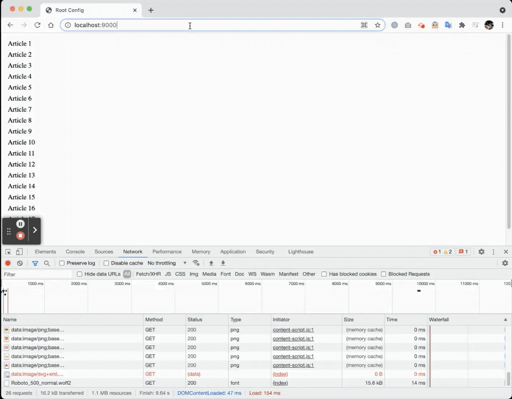

# Single Spa Article
页面运行结果 demo 请看一下 Gif Demo。

## 简介
- 项目包含三个 app，其中，root-config 是主 app，sidebar 和 content 是两个子 app。都是基于 `React` 实现。
- root-config 中包含了 app 的公用资源，以及 single-spa 的配置信息。
  在 `./root-config/src/index.ejs` 里 使用 `SystemJS` import 了两个子 app。
  root-config 打包会生成 `article-root-config.js`。
- sidebar 是左侧文章列表。sidebar 打包会生成 `article-sicebar.js`
- content 是右侧文章详细内容。content 打包会生成 `article-content.js`

## 运行
- `cd week4/single-spa-article`
- 分别到 `root-config`, `sidebar`, `content` 执行 `yarn install`
- 分别到 `root-config`, `sidebar`, `content` 执行 `yarn start`
- `go to http://localhost:9000/`

## Gif demo

