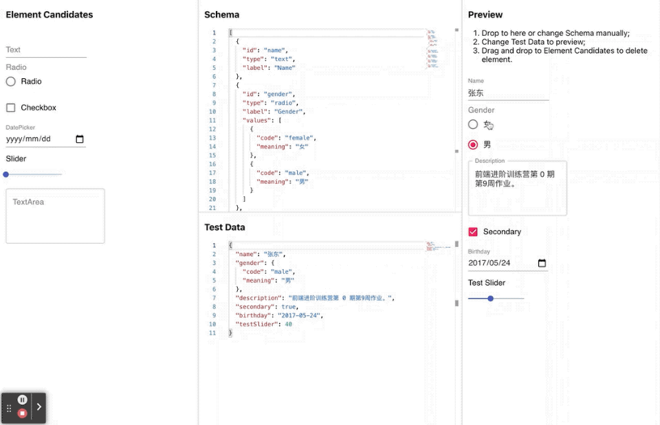

# Monaco Editor Vue Test

简单的演示请看下面 **Gif 演示**

## Gif 演示

## 功能

- 实现根据 schema json 动态生成 form 组件。
- 实现拖拽添加组件、修改修改组件，并生成 schema json。
- 集成 monaco，实现手动微调修改 schema json，同时动态生成 form 组件。
- 使用 monaco editor 编辑 test data，并实施预览 form 组件效果。

## 如何运行
1. `cd week9/configurable-form`
2. `npm instasll`
3. `npm start`
4. `go to http://localhost:9090`

